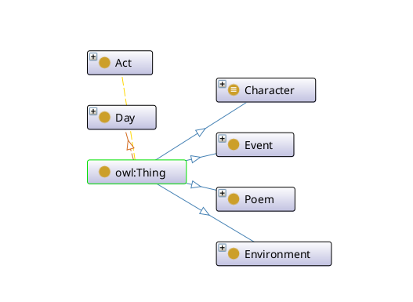
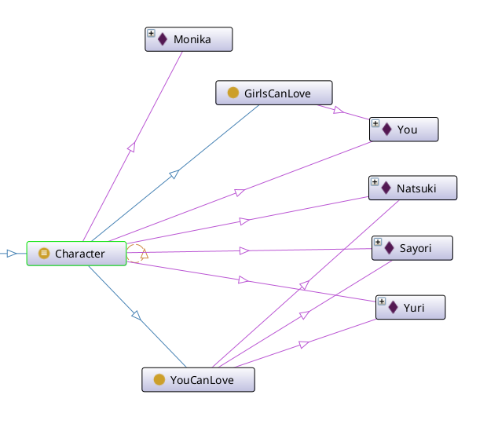

# Отчёт по Модулю 1

> Бутвин Михаил P3330


## 1. Введение

Целью первого модуля было знакомство с основными концепциями баз знаний и онтологий, изучение инструментов создания онтологий - Prolog и Protege, а также приобретение навыков работы по созданию собственной системы принятия решений.

## 2. Анализ требований

**Основные требования к системе поддержки принятия решений:**
- Корректная обработка запросов пользователя
- Удобный и эффективный интерфейс для взаимодействия с системой
- Корректность взаимодействия с базой данных и принятия решений

**Требования к базе знаний и онтологии:**
- Полнота и достоверность информации
- Отсутствие противоречий в базе знаний
- Четкое определение модели открытого или закрытого мира
- Понятная иерархия онтологии, система классов и атрибутов, отражающая предметную область

## 3. Изучение основных концепций и инструментов

База знаний - это совокупность фактов и правил, описывающих некоторую предметную область.
В отличии от базы данных, база знаний позволяет получать новую информацию на основе уже имеющихся фактов и правил.

Онтология - это формализованное описание предметной области, включающее в себя понятия, связи между ними и правила вывода.
Онтология позволяет описывать предметную область в терминах классов и экземпляров, а также связей между ними.
Онтология - основа для создания базы знаний.

Язык Prolog основан на логике предикатов, которая позволяет естественным образом описывать факты и правила.
Prolog позволяет создавать базы знаний и реализовывать логику вывода на основе этих знаний.

## 4. Реализация системы искусственного интеллекта

В первой лабораторной работе я разработал базу знаний на языке Prolog и создал онтологию в Protege, основываясь на игре Doki Doki Literature Club: [GitHub](https://github.com/butvinm/artificial-inelegance/tree/master/lab1)

База знаний содержит в себе список персонажей, возможных отношений, описания стихотворений и их авторов, логику появления стихотворений в игре, отношение слов, доступных для написания стихотворений и соответствующих персонажей.

База знаний позволяет узнать, когда появляются стихотворения, какие слова нужно использоваться, чтобы сблизиться с определённым персонажем, кто будет убит и другие факты, связанные с игрой.
Онтология в Protege отражает факты и отношения базы знаний и позволяет выводить новые факты, такие как появление стихотворения, используя правила, написанные на языке SWRL.

Примеры запроса к базе знаний:

```prolog
% Prove that Monika will kill all characters. Supposed to succeed.
?- forall((can_love(X), writeln(X)), monika_kills(X)).
natsuki
sayori
yuri
true.

% Natsuki poem at Act 1 day 4 if you didnt dedicate your poems to Natsuki.
?- findall(Poem, (appears(Poem, 1, 4, ['Adventure', 'Alone', 'Amazing']), author_is(Poem, character(natsuki))), R).
R = [poem('I`ll Be Your Beach')].
```

Онтограф построенной онтологии:






Во второй лабораторной работе я реализовал систему поддержки принятия решений на основе базы знаний на языке Prolog и интерфейса на Рефал: [GitHub](https://github.com/butvinm/artificial-inelegance/tree/master/lab2)

Язык [Рефал](https://ru.wikipedia.org/wiki/%D0%A0%D0%B5%D1%84%D0%B0%D0%BB) был выбран, так как он изначально проектировался для решение проблем, связанных с искусственным интеллектом.

Разработанная система использовала запросы к базе знаний на Prolog для получения рекомендаций по выбору слов в стихотворении, которые помогут сблизиться с определённым персонажем из игры Doki Doki Literature Club.
При этом введенные данные проверялись с учетом фактов из базы знаний - осуществлялась проверка наличия персонажа в игре, предлагался список корректных персонажей.

Пример диалога с системой:

```
>> Hi! I`m your personal assistant for awesome DDLC game.
   I can help you with poem writing. Just say which girl you`d like to charm:
me
>> Sorry, I don`t know me.
   You can choose one of the following names:
   - Natsuki
   - Sayori
   - Yuri
>> Please, try again:
Natsuki
>> Great! I`ll help you to charm Natsuki.
   Send me words you have and I`ll suggest which are the best for her.
   Type "exit" to finish.
Hopeless Treasure Dance Misery Heavensent Sunset Sugar Anime Destiny Puppy
>> I`ll think about Sugar.
   Send me another word or type "exit" to finish.
Feather Dazzle Holiday Email Candy Incongruent Parfait Email Raindrops Playground
>> I`ll think about Email.
   Send me another word or type "exit" to finish.
exit
I had great time with you. Goodbye!
```

## 5. Оценка и интерпретация результатов

Разработанная система выполняет поставленную задачу и дает корректные подсказки при выборе слов.
В дальнейшем базу знаний можно расширить, добавив туда полное описание сюжетных развилок игры и построить систему поддержки принятия решений, которая позволяла бы достичь любой из концовок игры.

## 6. Заключение

Одним из очевидных применений Prolog является создание баз знаний.

Например, одной из фич продукта, который разрабытывает компания, в которой я работаю, является Бизнес Глоссарий.
По сути, бизнес глоссарий является онтологией: в нем есть бизнес-термины, иерархия терминов, атрибуты и связи между терминами.
Внедрение в наш продукт системы вывода новых связей с использованием пролого-подобного языка для описания правил вывода
позволит в разы сократить количество ручного труда, а также улучшить качество и полноту глоссария.
